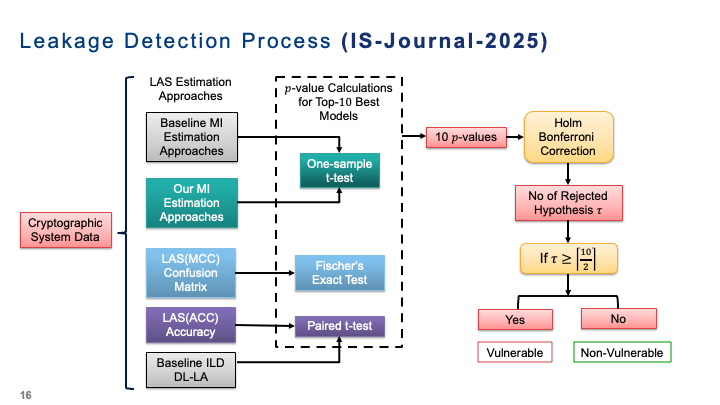
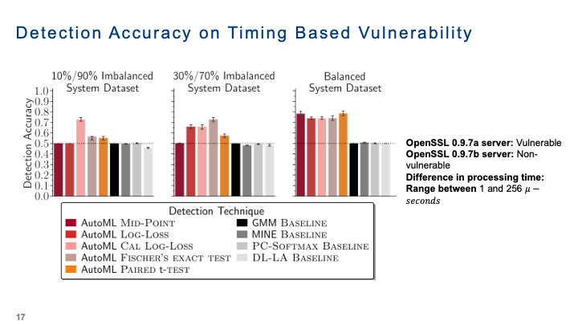
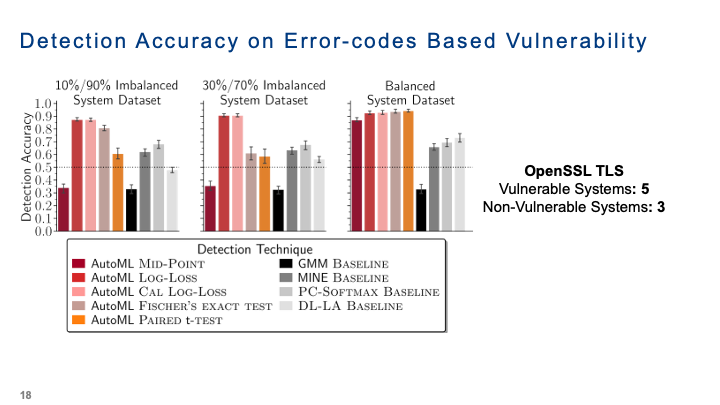

<div align="left">
  <a href="https://arxiv.org/abs/2401.14283">
    
  </a>
</div>


[](https://github.com/LeakDetectAI/AutoMLQuantILDetect/blob/master/LICENSE)
[](https://github.com/psf/black)
[](https://automlquantildetect.readthedocs.io/?badge=latest)
[](https://arxiv.org/abs/2401.14283)

### AutoML Approaches to Quantify and Detect Leakage
The <strong>AutoMLQuantILDetect</strong> package utilizes AutoML approaches to accurately detect and quantify system information leakage.
We also provide different approaches to estimate <strong>mutual information (MI)</strong> within systems that release classification datasets to quantify system information leakage.
By leveraging state-of-the-art statistical tests, it precisely quantifies mutual information (MI) and effectively detects 
information leakage within classification datasets. With <strong>AutoMLQuantILDetect</strong>, users can confidently and 
comprehensively address the critical challenges of quantification and detection in information leakage analysis.


### 🛠️ Installation

The latest release version of AutoMLQuantILDetect can be installed from GitHub using the following command:

```
export SKLEARN_ALLOW_DEPRECATED_SKLEARN_PACKAGE_INSTALL=True
pip install git+https://github.com/LeakDetectAI/AutoMLQuantILDetect.git
```

Alternatively, you can clone the repository and install AutoMLQuantILDetect using:

```
export SKLEARN_ALLOW_DEPRECATED_SKLEARN_PACKAGE_INSTALL=True
git clone https://github.com/LeakDetectAI/AutoMLQuantILDetect.git
cd AutoMLQuantILDetect
conda create --name ILD python=3.10
conda activate ILD
```
```
python setup.py install
```
**OR**
```
pip install -r requirements.txt
pip install -e ./
```

## ⚙️ Quickstart Guide
You can use `AutoMLQuantILDetect` in different ways.
Quite a few classifiers and AutoML tools already exist that can be used to estimate mutual information using the log-loss and the accuracy of the learned model.


### 📈 Fit a Classifier to Estimate MI
Fit a ClassficationMIEstimator on a synthetic dataset using a random forest, estimate mutual information using the log-loss and the accuracy of the learned model and compare it with the ground-truth mutual information.
You can find similar example code snippets in
**examples/**.

```python
from sklearn.metrics import accuracy_score
from autoqild.dataset_readers.synthetic_data_generator import SyntheticDatasetGenerator
from autoqild.mi_estimators.mi_estimator_classification import ClassificationMIEstimator
from autoqild.utilities._constants import LOG_LOSS_MI_ESTIMATION, MID_POINT_MI_ESTIMATION

# Step 1: Generate a Synthetic Dataset
random_state = 42
n_classes = 3
n_features = 5
samples_per_class = 200
flip_y = 0.10  # Small amount of noise

dataset_generator = SyntheticDatasetGenerator(
    n_classes=n_classes,
    n_features=n_features,
    samples_per_class=samples_per_class,
    flip_y=flip_y,
    random_state=random_state
)

X, y = dataset_generator.generate_dataset()

print(f"Generated dataset X shape: {X.shape}, y shape: {y.shape}")

# Step 2: Estimate Mutual Information using ClassficationMIEstimator
mi_estimator = ClassificationMIEstimator(n_classes=n_classes, n_features=n_features, random_state=random_state)

# Fit the estimator on the synthetic dataset
mi_estimator.fit(X, y)

# Estimate MI using log-loss
estimated_mi_log_loss = mi_estimator.estimate_mi(X, y, method=LOG_LOSS_MI_ESTIMATION)
estimated_mi_mid_point = mi_estimator.estimate_mi(X, y, method=MID_POINT_MI_ESTIMATION)
# Step 3: Calculate Accuracy of the Model
y_pred = mi_estimator.predict(X)
accuracy = accuracy_score(y, y_pred)

# Step 4: Compare with Ground-Truth MI
ground_truth_mi = dataset_generator.calculate_mi()

# Summary of Results
print("##############################################################")
print(f"Ground-Truth MI: {ground_truth_mi}")
print(f"Estimated MI (Log-Loss): {estimated_mi_log_loss}")
print(f"Estimated MI (Mid-Point): {estimated_mi_mid_point}")
print(f"Model Accuracy: {accuracy}")

>> Generated
dataset
X
shape: (600, 5), y
shape: (600,)
>>  ##############################################################
>> Ground - Truth
MI: 1.1751928845077875
>> Estimated
MI(Log - Loss): 1.3193094645863748
>> Estimated
MI(Mid - Point): 1.584961043823006
>> Model
Accuracy: 1.0

```

## AutoML-based Leakage Detection and Evaluation



This repository implements an **automated information leakage detection (ILD) pipeline** using AutoML approaches combined with statistical hypothesis testing.

### Approach Overview

Given cryptographic system data (e.g., timing traces or error codes), the pipeline:

1. **Estimates leakage (LAS)** using multiple approaches:
   - Mutual Information (MI)-based methods (baseline and proposed)
   - Classification-based metrics (accuracy, confusion matrix)

2. **Applies statistical tests**:
   - One-sample t-test (on MI estimates)
   - Fisher’s Exact Test (on confusion matrices)
   - Paired t-test (on accuracy)

3. **Aggregates evidence**:
   - Computes p-values across top-performing AutoML models
   - Applies **Holm-Bonferroni correction** for robust decision-making

4. **Final decision**:
   - System is classified as **Vulnerable** or **Non-Vulnerable** based on rejected hypotheses

This provides a **fully automated, statistically grounded framework** for detecting side-channel leakage without manual feature engineering. 

 
## Results and Interpretation

### Timing-based Side Channels



We evaluate detection accuracy using the **best AutoML pipeline**, incorporating recent advances such as TabPFN within AutoGluon.

The experiments are conducted on OpenSSL TLS servers vulnerable to Bleichenbacher-style attacks, where leakage arises from **subtle timing differences** between valid and invalid cryptographic operations.

#### Key Findings

- **LAS-based AutoML approaches consistently outperform baseline MI estimators**
- Strong performance on **balanced datasets**
- Robust under **class imbalance**, unlike baseline methods
- Baselines degrade when:
  - Timing differences are small  
  - Data is skewed  

#### Interpretation

AutoML-based LAS methods approximate the **Bayes-optimal predictor**, enabling reliable detection of weak timing leakages in noisy, real-world conditions.

---

### Error-code Based Side Channels



We evaluate detection on OpenSSL systems:
- 5 Vulnerable  
- 3 Non-Vulnerable  

#### Key Findings

- **Mid-point MI estimation fails under class imbalance**
- **Log-loss and calibrated log-loss remain stable and effective**
- AutoML-based LAS approaches achieve **consistently high accuracy**

#### Baseline Comparison

- **GMM / MINE** → moderate performance, sensitive to imbalance  
- **PC-Softmax** → better with imbalance, but still weaker than AutoML  

#### Interpretation

Classical MI estimators struggle in realistic conditions, while AutoML-based LAS methods provide:
- Stability across dataset distributions  
- Better generalization  
- Reliable vulnerability detection  

---

### Overall Insight

Combining:
- **AutoML (model selection)**  
- **LAS (leakage quantification)**  
- **Statistical testing (robust decisions)**  

results in a **scalable, automated framework** for detecting side-channel vulnerabilities in cryptographic systems.

 
## 💬 Cite Us

If you use this toolkit in your research, please cite our work:

- 📄 **Journal Paper (Information Sciences, 2025)**  
- 📘 **PhD Dissertation (2025)** for a more in-depth understanding  

### BibTeX

```bibtex
  @article{GUPTA2025122419,
    title   = {Information leakage detection through approximate Bayes-optimal prediction},
    journal = {Information Sciences},
    volume  = {719},
    pages   = {122419},
    year    = {2025},
    issn    = {0020-0255},
    doi     = {https://doi.org/10.1016/j.ins.2025.122419},
    url     = {https://www.sciencedirect.com/science/article/pii/S0020025525005511},
    author  = {Pritha Gupta and Marcel Wever and Eyke Hüllermeier}
  }
  
  @PhdThesis{Gupta2025,
    author    = {Gupta, Pritha},
    title     = {Advanced Machine Learning Methods for Information Leakage Detection in Cryptographic Systems},
    series    = {Institut f{\"u}r Informatik},
    year      = {2025},
    publisher = {Ver{\"o}ffentlichungen der Universit{\"a}t},
    address   = {Paderborn},
    pages     = {1 Online-Ressource (3, xi, 272 Seiten) Diagramme},
    note      = {Tag der Verteidigung: 09.05.2025},
    note      = {Universit{\"a}t Paderborn, Dissertation, 2025},
    url       = {https://nbn-resolving.org/urn:nbn:de:hbz:466:2-54956},
    language  = {eng}
}
```

## 📧 Contact Information
For any questions or feedback, please contact Pritha Gupta at prithagupta.nsit@icloud.com.


